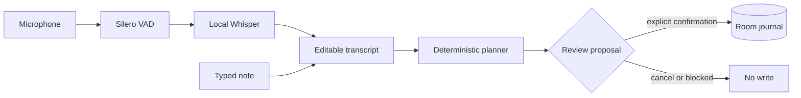

# Diarium

Diarium is a mobile-first, offline field journal built with Kotlin
Multiplatform. The current Android application combines on-device speech
recognition, deterministic inspection planning, confirmed structured tool
execution, and a persistent beekeeping inspection journal.

The implemented command path supports English, German, Serbian Latin, and
Serbian Cyrillic:

Start with the [architecture](docs/architecture.md), then use the
[journal](docs/journal.md) for chronological progress and the next-session
handoff. Testing commands and acceptance coverage are in
[testing](docs/testing.md).
