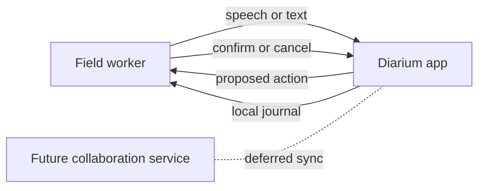
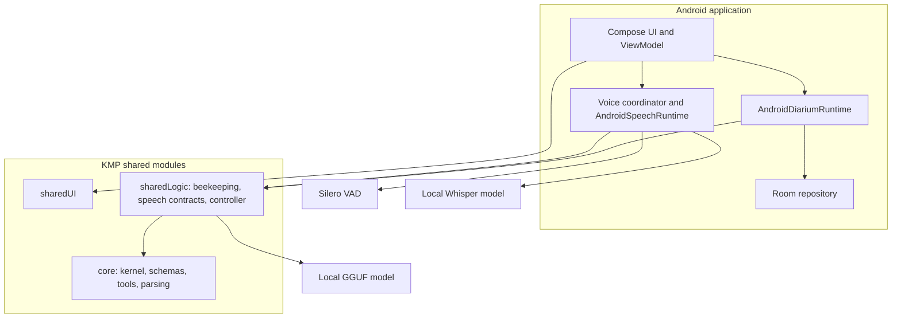
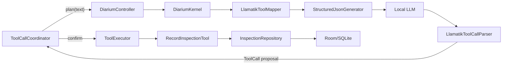
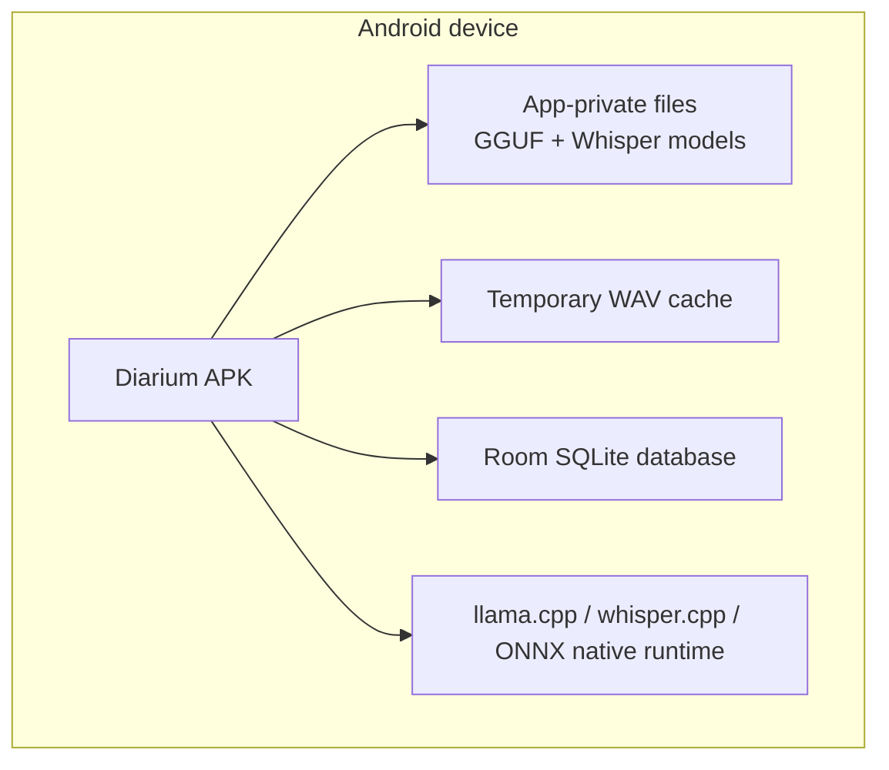

# Diarium architecture

This document follows the twelve-section [arc42](https://arc42.org/) structure,
but contains only project-specific information. Historical implementation notes
belong in the [journal](journal.md); durable choices belong in the
[architecture decision records](decisions/0001-microkernel-tool-contracts.md).

## 1. Introduction and goals

### Purpose

Diarium is a mobile-first, offline field journal. A worker can speak or type an
observation, inspect the proposed structured action, and explicitly confirm it
before deterministic application code changes local data.

The first domain is beekeeping. The core is intentionally domain-neutral so
that later applications can register different tools without replacing the
speech and local-inference infrastructure.

### Current functional scope

- Android microphone capture with automatic end-of-speech detection.
- Local multilingual transcription in English, German, and Serbian.
- Local conversion of natural language into a registered tool call.
- Explicit confirmation before a mutating tool executes.
- Offline persistence and display of recent hive inspections.
- Private import and restoration of local Whisper and GGUF models.

Hotword detection, TTS, multi-turn conversation, production model downloads,
additional beekeeping tools, and multi-worker synchronization are outside the
current milestone.

### Quality goals

| Priority | Goal | Meaning for Diarium |
| --- | --- | --- |
| 1 | Safety | Probabilistic output never mutates state without an explicit confirmation. |
| 2 | Offline availability | Capture, transcription, inference, execution, and persistence work without a network. |
| 3 | Multilingual correctness | English, German, Serbian Latin, and Serbian Cyrillic preserve identifiers and meaning. |
| 4 | Portability | Domain contracts and shared UI/logic remain usable from Kotlin Multiplatform targets. |
| 5 | Extensibility | A new domain operation is introduced as a typed tool, not as UI-specific parsing. |
| 6 | Testability | Pure transformations and boundaries are testable without native models or a phone. |

### Stakeholders

| Stakeholder | Expectations |
| --- | --- |
| Field worker | Fast hands-free capture, understandable confirmation, no lost or invented records. |
| Product owner/developer | A maintainable codebase despite limited Kotlin-specific experience. |
| Future domain developer | Stable tool and schema contracts independent of Android and beekeeping. |
| Future apiary owner/team | Shared data with ownership, auditability, and explicit conflict behavior. |

## 2. Architecture constraints

| Constraint | Consequence |
| --- | --- |
| Core operations are local-first | Models and Room data live in application-private storage. |
| Android is the first complete runtime | Android owns audio, Silero VAD, native model lifecycle, and Room adapters. |
| Kotlin Multiplatform is retained | Shared modules use KMP source sets such as `commonMain` and platform implementations. |
| Llamatik 1.9 native grammar generation can abort the process | Prompt-guided JSON is the safe default until a verified upstream fix exists. |
| Local models are probabilistic | Tool arguments are proposals; deterministic Kotlin validates and executes them. |
| German and Serbian are release requirements | Multilingual Whisper models are mandatory; `.en`-only models are unsuitable. |
| Model files are too large for the repository | Development models are imported at runtime and CI uses fakes or optional provisioned models. |

The package and source-set directory conventions are explained in
[Project structure](project-structure.md).

## 3. Context and scope

### Business context

The worker is currently the only external actor. No backend participates in
the runtime path. A future collaboration service is an architectural concern,
not a current dependency.

### Technical context

| Input/output | Interface | Format |
| --- | --- | --- |
| Microphone input | Android `AudioRecord` | 16 kHz mono PCM16 frames |
| End-of-speech | Silero via `android-vad` | speech/non-speech decisions over 512-sample frames |
| Speech recognition | Llamatik Whisper bridge | temporary WAV in, segmented JSON/transcript out |
| Command inference | Llamatik llama.cpp bridge | prompt plus schemas in, JSON tool envelope out |
| Persistent storage | Room/SQLite | inspection entities and ordered queries |
| Model import | Android document picker | `.gguf` LLM and `.bin` Whisper files |

All runtime data stays on the device in the current architecture.

## 4. Solution strategy

Diarium separates probabilistic interpretation from deterministic effects:

1. Platform adapters acquire speech and produce an editable transcript.
2. The domain-neutral kernel asks the local model for one registered tool call.
3. Kotlin parses the response into a typed `ToolCall`.
4. The UI presents the proposed tool and arguments.
5. Only explicit confirmation invokes the registered Kotlin tool.
6. The tool validates its arguments and writes through a repository contract.

The design uses a small microkernel, KMP shared contracts, platform adapters,
and local persistence. Native model lifecycles are separate so replacing the
speech model cannot accidentally invalidate the command model and vice versa.

## 5. Building block view

### Level 1: overall system

| Building block | Responsibility | Must not own |
| --- | --- | --- |
| `core` | Tool contracts, JSON Schema, registry/executor, prompt mapping, response parsing, plan/execute kernel. | Android, audio, Room, or beekeeping persistence. |
| `sharedLogic` | Domain tools and repositories, controller composition, speech value types and portable transforms. | Android lifecycle or Compose widgets. |
| `sharedUI` | Portable Compose screen and localized display copy. | Native audio/model implementations or database access. |
| `androidApp` | Permissions, document pickers, coordinators, native model/audio lifecycle, Room adapter. | New generic tool/schema behavior that belongs in shared code. |
| `iosApp` | iOS host and embedded KMP framework build. | Android implementations; full voice parity is not implemented yet. |

### Level 2: command and persistence path

Important interfaces:

- `StructuredJsonGenerator` isolates the kernel from a particular inference engine.
- `Tool` combines a JSON Schema specification with deterministic execution.
- `InspectionRepository` isolates domain behavior from Room.
- `DiariumKernel.plan` has no intended state mutation; `execute` is the effect boundary.

### Level 2: voice path

`AndroidVoiceRecorder` owns `AudioRecord`, Silero decisions, time limits, and
WAV encoding. `AndroidSpeechRuntime` owns the Whisper model lifecycle and
temporary-file cleanup. `VoiceInputCoordinator` turns the resulting transcript
into normal command input; the rest of the kernel does not know whether text
was typed or spoken.

## 6. Runtime view

### Voice inspection write

1. The user selects a language and starts recording.
2. Android captures 16 kHz mono PCM16 frames.
3. Silero VAD stops capture after sustained silence; a 30-second cap prevents
   unbounded recording.
4. The WAV is transcribed locally without translation and then deleted.
5. The editable transcript is passed to `DiariumKernel.plan`.
6. The local LLM proposes a tool envelope; Kotlin parses it into a `ToolCall`.
7. The UI displays the tool and arguments. Room is unchanged.
8. Cancel discards the proposal. Confirm calls `DiariumKernel.execute`.
9. `RecordInspectionTool` validates the arguments and writes through Room.
10. The journal refreshes from the repository.

### Application startup

1. Room and the recent journal load independently of model initialization.
2. The newest privately stored LLM and Whisper models are discovered.
3. Each native runtime initializes independently and publishes its own status.
4. Text processing requires the LLM; recording additionally requires Whisper
   and microphone permission.

### Failure behavior

- A recording, transcription, model, parsing, or execution failure is surfaced
  as UI state and must not create a record.
- Changing transcript text invalidates any pending proposal.
- Temporary audio is removed after transcription and stale capture files are
  cleaned before a new recording.
- Native grammar generation remains disabled by default because its failure is
  an unrecoverable process abort rather than a Kotlin exception.

## 7. Deployment view

### Android device

Android API 24 is the minimum imposed by the selected VAD dependency. Models
are user-provisioned and are not packaged in the APK. Removing app data removes
the private models and Room database.

### Build and verification infrastructure

- Linux CI runs static analysis, JVM/KMP tests, Android lint, and APK/test APK builds.
- An API 35 x86_64 emulator runs Android instrumentation tests.
- macOS CI builds the iOS simulator application and embedded KMP framework.
- CodeQL scans Actions, Java/Kotlin, and Swift using explicit real build targets.
- Physical-device acceptance covers native models, microphone behavior, and
  multilingual recognition quality that emulation cannot establish.

## 8. Cross-cutting concepts

### Safety boundary

The model may propose an operation but cannot directly access Room. Planning
and execution are separate APIs, and every mutating proposal requires explicit
confirmation. Argument validation is still required inside each tool because a
confirmation does not make malformed data valid.

### Multilingual behavior

The selected language provides a Whisper language code and vocabulary prompt.
Whisper does not translate. Serbian prompts include Latin and Cyrillic forms.
Tool prompts instruct the LLM to preserve source identifiers. Automated tests
cover Unicode and the plan/confirm/persist boundary; real speech quality remains
a physical acceptance concern.

### Local model lifecycle

LLM and Whisper models use separate stores and native owners. Import is atomic
through a partial file, model files remain private, and shutdown releases native
resources. Model selection currently means “newest imported compatible file”;
profiles and comparative evaluation are planned.

### Persistence

Room is an Android adapter behind `InspectionRepository`. Database-generated
numeric IDs are local identities only. They must not become synchronization IDs.
Schema exports are versioned so future migrations can be tested.

### Testing

Pure Kotlin tests cover schemas, parsing, prompts, speech transforms, and domain
behavior. Integration tests cross the kernel/repository boundary. Android tests
cover Room, Activity launch, Silero inference, and optional real Whisper model
initialization. See [Testing](testing.md).

### Source organization

KMP source-set folders, Kotlin package namespaces, and feature folders form
separate axes. The apparent nesting is explained in
[Project structure](project-structure.md); new code should remain organized by
feature below the stable `com.shraggen.diarium` base package.

## 9. Architecture decisions

Durable decisions are recorded separately so their context and consequences do
not disappear inside a large architecture page:

1. [ADR 0001: Use a microkernel with registered tool contracts](decisions/0001-microkernel-tool-contracts.md)
2. [ADR 0002: Separate planning from confirmed execution](decisions/0002-plan-confirm-execute.md)
3. [ADR 0003: Use prompt-guided JSON until native grammar is safe](decisions/0003-prompt-guided-json.md)
4. [ADR 0004: Separate speech, VAD, and command-model lifecycles](decisions/0004-separate-native-model-lifecycles.md)
5. [ADR 0005: Keep persistence offline-first and defer collaboration](decisions/0005-offline-first-sync-later.md)

New decisions should use the same Context / Decision / Consequences format and
supersede old ADRs instead of rewriting their history.

## 10. Quality requirements

| Scenario | Expected response |
| --- | --- |
| The LLM proposes a write | No repository mutation occurs until the user confirms. |
| The user edits or cancels a proposal | The pending call is invalidated and persistence remains unchanged. |
| The device has no network | Existing imported models and the local journal remain usable. |
| A German or Serbian command contains an explicit hive ID | The transcript and proposed argument preserve it; disagreement must be visible and is the next hardening target. |
| Native model initialization fails | The failure is isolated to that model status and does not corrupt the journal. |
| The app is force-stopped after a confirmed write | Room restores the record on relaunch. |
| A new domain tool is added | Core routing does not require Android or UI changes beyond presenting the registered proposal. |
| A pull request changes a boundary | Unit, integration, Android, architecture-fitness, and static checks catch regressions proportionately. |

## 11. Risks and technical debt

### Immediate: transcript/tool identifier disagreement

The 2026-07-14 multilingual field test succeeded end to end, but one Serbian
screenshot contained the word `pet` (five) while the recorded result showed
Hive 4. This must be reproduced and guarded independently of model upgrades.
The next milestone is a multilingual identifier-consistency validator and an
evaluation corpus for tool calls.

### Probabilistic inference

The development Whisper base model and 0.5B command model trade quality for
device cost. Larger multilingual models may improve recognition and intent
mapping, but do not replace deterministic validation. Accuracy, latency, RAM,
thermal load, and battery usage need comparative measurements.

### Prompt-guided structured output

The current inference mode can emit malformed or fenced JSON because grammar
constraints are not enforced natively. Parsing tests reduce the risk but cannot
make a small language model deterministic. A verified upstream grammar fix or
another constrained decoder may supersede ADR 0003.

### Future collaboration and synchronization

The current auto-increment Room ID is not a global identity. Before shared
apiaries are implemented, the design needs globally unique record, apiary,
actor, and device IDs; versions and tombstones; idempotency and a durable
outbox; membership and audit rules; encryption; conflict semantics; Room
migrations; and a threat model. Last-write-wins is not an acceptable implicit
policy for safety-relevant data.

### Platform parity

The iOS host builds, but the production audio, local model, and persistence
experience is Android-first. iOS parity needs explicit product prioritization
and platform implementations rather than being inferred from KMP compilation.

## 12. Glossary

| Term | Definition |
| --- | --- |
| ADR | Architecture Decision Record: an immutable account of a significant choice and its consequences. |
| ASR | Automatic speech recognition; Whisper performs this locally. |
| KMP | Kotlin Multiplatform, which provides shared and platform-specific source sets. |
| Kernel | Domain-neutral planning and tool-execution machinery in `core`. |
| Tool | A JSON-Schema-described operation implemented by deterministic Kotlin code. |
| Tool call | A model-proposed tool name plus arguments; it is not execution. |
| VAD | Voice activity detection; Silero determines speech versus silence during capture. |
| GGUF | File format used for the local llama.cpp command model. |
| Room | Android persistence library over SQLite. |
| Source set | A KMP compilation group such as `commonMain`, `androidMain`, or `commonTest`. |
