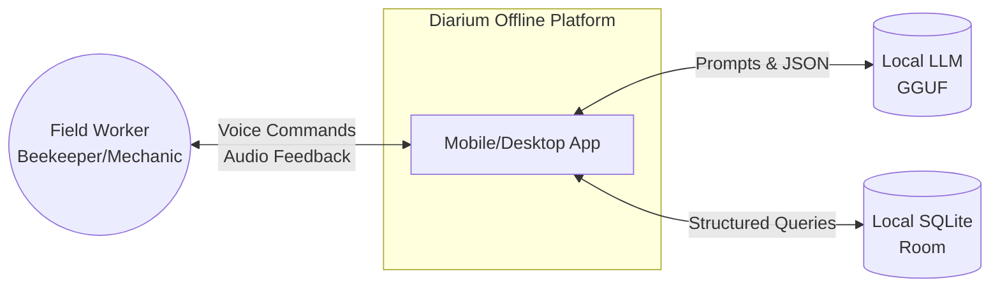
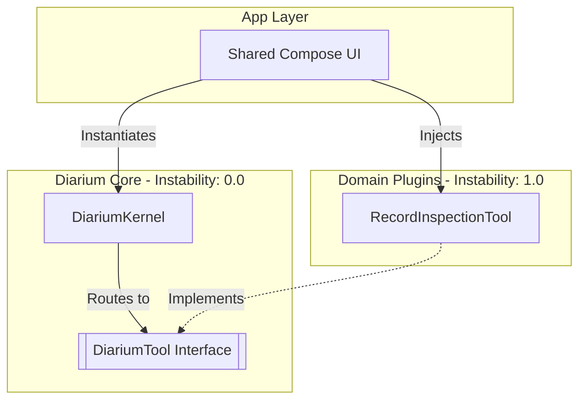

# 

**About arc42**

arc42, the template for documentation of software and system
architecture.

Template Version 9.0-EN. (based upon AsciiDoc version), July 2025

Created, maintained and © by Dr. Peter Hruschka, Dr. Gernot Starke and
contributors. See <https://arc42.org>.

# Introduction and Goals

## Requirements Overview

## Quality Goals

## Stakeholders

| Role/Name    | Contact         | Expectations        |
|--------------|-----------------|---------------------|
| *\<Role-1\>* | *\<Contact-1\>* | *\<Expectation-1\>* |
| *\<Role-2\>* | *\<Contact-2\>* | *\<Expectation-2\>* |

# Architecture Constraints

# Context and Scope

## Business Context

**Explanation:**  
Diarium operates entirely offline. The user interacts via voice. The app uses a local LLM to translate natural language into structured JSON tool-calls, which mutate local state in the database.

## Technical Context

**\<Diagram or Table\>**

**\<optionally: Explanation of technical interfaces\>**

**\<Mapping Input/Output to Channels\>**

# Solution Strategy

# Building Block View

## Whitebox Overall System

This diagram illustrates the Microkernel (Plugin) Architecture of Diarium. 
The Core module remains completely isolated from domain-specific business rules.

**Motivation:**  
We chose a Microkernel Architecture over a Pipeline or Service-Based architecture to support maximum extensibility. The `Core` acts as an offline Voice OS, while specific professions (Beekeepers, Mechanics) are injected as Plugins.

**Contained Building Blocks:**  
* **Diarium Core:** Contains LLM orchestration and tool routing. It knows nothing about bees, cars, Android audio, or Room.
* **Domain Plugins (`sharedLogic`):** Contains the JSON Schema definitions and database execution logic for specific tasks.
* **App Layer:** `sharedUI` renders portable state. The Android app owns microphone capture, Silero VAD, Llamatik Whisper, model storage, Room, and lifecycle coordinators.

## Whitebox Overall System

***\<Overview Diagram\>***

Motivation  
*\<text explanation\>*

Contained Building Blocks  
*\<Description of contained building block (black boxes)\>*

Important Interfaces  
*\<Description of important interfaces\>*

### \<Name black box 1\>

*\<Purpose/Responsibility\>*

*\<Interface(s)\>*

*\<(Optional) Quality/Performance Characteristics\>*

*\<(Optional) Directory/File Location\>*

*\<(Optional) Fulfilled Requirements\>*

*\<(optional) Open Issues/Problems/Risks\>*

### \<Name black box 2\>

*\<black box template\>*

### \<Name black box n\>

*\<black box template\>*

### \<Name interface 1\>

…​

### \<Name interface m\>

## Level 2

### White Box *\<building block 1\>*

*\<white box template\>*

### White Box *\<building block 2\>*

*\<white box template\>*

…​

### White Box *\<building block m\>*

*\<white box template\>*

## Level 3

### White Box \<\_building block x.1\_\>

*\<white box template\>*

### White Box \<\_building block x.2\_\>

*\<white box template\>*

### White Box \<\_building block y.1\_\>

*\<white box template\>*

# Runtime View

## Voice inspection write

1. Android records 16 kHz mono PCM16 frames.
2. Bundled Silero VAD detects an utterance and ends capture after sustained
   silence; a 30-second cap prevents unbounded recording.
3. The temporary WAV is transcribed locally by Llamatik Whisper without
   translation. The selected language is `en`, `de`, or `sr`.
4. The transcript is placed in the editable command field and sent to
   `DiariumKernel.plan`.
5. The UI displays the exact proposed tool name and arguments. No mutation has
   occurred yet.
6. Only explicit confirmation calls `DiariumKernel.execute`, whose deterministic
   `RecordInspectionTool` writes through `InspectionRepository` to Room.
7. The temporary WAV is deleted and the persisted journal is refreshed.

## \<Runtime Scenario 2\>

## …​

## \<Runtime Scenario n\>

# Deployment View

## Infrastructure Level 1

***\<Overview Diagram\>***

Motivation  
*\<explanation in text form\>*

Quality and/or Performance Features  
*\<explanation in text form\>*

Mapping of Building Blocks to Infrastructure  
*\<description of the mapping\>*

## Infrastructure Level 2

### *\<Infrastructure Element 1\>*

*\<diagram + explanation\>*

### *\<Infrastructure Element 2\>*

*\<diagram + explanation\>*

…​

### *\<Infrastructure Element n\>*

*\<diagram + explanation\>*

# Cross-cutting Concepts

## *\<Concept 1\>*

*\<explanation\>*

## *\<Concept 2\>*

*\<explanation\>*

…​

## *\<Concept n\>*

*\<explanation\>*

# Architecture Decisions

**Title:** ADR 001 - Use a Microkernel Tool-Calling Architecture for Multi-Domain Voice Operations
**Date:** 10.07.2026
**Status:** Accepted

**Context:**
The app must transition from a hardcoded beekeeping intent-recognition pipeline to a domain-agnostic platform capable of supporting multiple field professions (e.g., car mechanics). Relying on prompt-based text extraction is brittle. The technical components (ASR/TTS) are becoming decoupled from the domain logic.

**Decision:**
We will implement a KMP-based **Microkernel Architecture** utilizing LLM Tool Calling (JSON Schema enforcement).
1. The **Core Engine** will handle the speech-to-text-to-LLM workflow.
2. Domains (Beekeeping, Mechanics) will be implemented as **Plugins** that inject a System Prompt and a list of `Tool` implementations.
3. The LLM will orchestrate flow by emitting Tool Execution Requests, but state mutation (Database writes) will remain strictly in deterministic Kotlin Code.

**Consequences:**
*   *Positive:* Adding a "Car Mechanic" version requires zero changes to the complex ML/Voice pipeline. We only write new Kotlin `Tool` classes and a new database schema.
*   *Positive:* Hallucinations are mitigated because the LLM can only interact via predefined, type-safe APIs.
*   *Negative:* Requires strict schema definitions and mapping layers between LLM JSON and Kotlin objects. Models chosen must natively support Function/Tool calling.

# Quality Requirements

## Quality Requirements Overview

## Quality Scenarios

# Risks and Technical Debts

## Future collaboration and synchronization

Centralized synchronization is intentionally deferred, but the data model must
evolve before multiple workers share an apiary. A compatible design needs:

- globally unique inspection, apiary/workspace, actor, and device identifiers;
- stable `apiary_id` ownership on every domain record;
- server-recognized creation/update timestamps, record versions, and tombstones;
- idempotency keys plus a durable local outbox so retries cannot duplicate work;
- optimistic concurrency and explicit conflict policy instead of last-write
  wins for safety-relevant fields;
- membership/role enforcement, audit history, encryption, and revocation;
- Room migrations that preserve offline-first behavior while adding sync state.

Do not retrofit synchronization by using current auto-increment Room IDs as
global identity. The collaboration protocol, conflict semantics, and schema
migration require their own ADR and threat model before backend implementation.

## Multilingual inference risk

Whisper and the local LLM are probabilistic. The confirmation boundary is
language-independent and remains mandatory for every mutation. Release
acceptance must cover English, German, Serbian Latin, and Serbian Cyrillic;
source text and identifiers must never be silently translated or invented.

# Glossary

| Term         | Definition         |
|--------------|--------------------|
| *\<Term-1\>* | *\<definition-1\>* |
| *\<Term-2\>* | *\<definition-2\>* |
