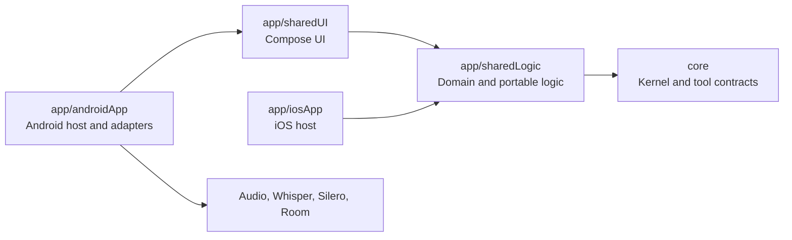

# Module and source-set reference

This page describes the repository's Gradle modules, dependency direction, and
Kotlin source sets.

## Module map

Arrows point from a consumer to the module or platform facilities it depends
on. The shared dependency chain terminates at the domain-neutral `core` module.
Shared modules do not depend on Android-native facilities.

| Module | Responsibility | Published boundary |
| --- | --- | --- |
| `core` | Domain-neutral schemas, tools, parsing, execution, and kernel orchestration. | `DiariumKernel`, tool and schema packages, and `StructuredJsonGenerator`. |
| `app/sharedLogic` | Beekeeping domain, controller composition, and portable speech logic. | `DiariumController`, beekeeping types, and speech contracts. |
| `app/sharedUI` | Shared Compose UI and localisation. | `App` and `PendingToolCall`. |
| `app/androidApp` | Android host, native runtimes, coordinators, and Room persistence. | `AndroidDiariumRuntime` and `AndroidSpeechRuntime`. |
| `app/iosApp` | iOS host and embedded Kotlin Multiplatform framework. | No published repository interface. |

The canonical boundary declarations are in
`.agents/architecture/bounded-contexts.yaml` and
`.agents/architecture/context-map.yaml`.

## Source sets

| Path | Contents |
| --- | --- |
| `core/src/commonMain` | Portable kernel and tool implementation. |
| `core/src/commonTest` | Portable kernel tests. |
| `core/src/jvmTest` | JVM-only kernel and architecture tests. |
| `app/sharedLogic/src/commonMain` | Portable beekeeping and speech logic. |
| `app/sharedLogic/src/commonTest` | Portable shared-logic tests and acceptance scenarios. |
| `app/sharedLogic/src/androidMain` | Android Llamatik generation and speech transcription implementations. |
| `app/sharedLogic/src/iosMain` | iOS Llamatik generation implementation. |
| `app/sharedLogic/src/jvmMain` | JVM Llamatik generation implementation. |
| `app/sharedUI/src/commonMain` | Shared Compose UI and resources. |
| `app/sharedUI/src/commonTest` | Portable presentation tests. |
| `app/androidApp/src/main` | Android application, adapters, resources, and manifest. |
| `app/androidApp/src/androidTest` | Instrumented Android tests. |

## Placement rules

- Portable business behaviour belongs in `app/sharedLogic/src/commonMain`.
- Domain-neutral tool and schema contracts belong in `core/src/commonMain`.
- Shared presentation belongs in `app/sharedUI/src/commonMain`.
- Android framework, native model, and persistence implementations belong in
  `app/androidApp/src/main` or the relevant `androidMain` source set.
- Tests use the source set matching the behaviour under test.
- Feature packages such as `beekeeping`, `speech`, `tool`, and `schema` sit
  below the stable `com.shraggen.diarium` base package.
- A Gradle module represents a dependency or deployment boundary, not merely a
  way to group files.

For the reasons behind the directory depth and package conventions, see
[Why source paths are deep](project-structure.md).
