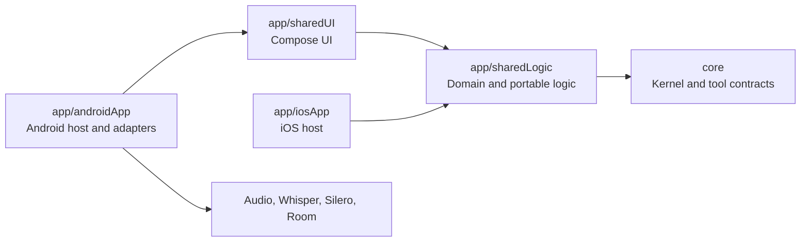

# Project structure

The directory depth in this repository comes from several independent naming
systems being written into one path. For example:

```text
app/sharedLogic/src/commonMain/kotlin/com/shraggen/diarium/speech/Transcript.kt
│       │       │    │        │              │
module  Gradle  KMP  language package        feature
```

## Which parts are required?

- `app/sharedLogic` is our Gradle module organization. We chose it.
- `src/commonMain` is the conventional Kotlin Multiplatform source-set layout.
  Gradle can be reconfigured, but keeping the convention makes builds and IDEs
  easier to understand.
- `kotlin` distinguishes Kotlin sources from resources and other languages.
- `com/shraggen/diarium` mirrors the package declaration
  `package com.shraggen.diarium`. Kotlin does not technically require the
  directory to match, but JVM/Android tools and developers strongly expect it.
- `speech` is useful project organization by feature.

So the frustration is fair: KMP contributes meaningful platform/source-set
structure, while JVM reverse-domain packages add several repetitive folders.
The combination is substantially noisier than Go or a modern SDK-style .NET
project.

## Why keep the reverse-domain package?

Java introduced reverse-domain namespaces to avoid collisions in a global
class ecosystem. Kotlin inherited the JVM package model for interoperability.
It is dated-looking, but `com.shraggen.diarium` is already the Android
namespace and the stable public package for this project. Renaming it would
touch source files, tests, manifests, generated Room schemas, and potentially
saved or reflected type names while delivering little runtime or maintenance
value.

The Android application ID and Kotlin package can technically differ, and
Kotlin permits a short package such as `diarium`. That is a reasonable
greenfield choice for a private project, but changing this repository now is
not recommended.

## How we keep it manageable

1. Treat `com.shraggen.diarium` as an invisible base namespace.
2. Organize code by feature below it: `speech`, `beekeeping`, `persistence`,
   `tool`, and `schema`.
3. Add a new Gradle module only for a real dependency or deployment boundary,
   not merely to sort files.
4. Keep platform code in its platform source set; keep portable behavior in
   `commonMain`.
5. Keep tests in the matching source set and package whenever practical.
6. Use the IDE's compact/flatten package display when browsing packages.

## Current module map



Arrows point from a consumer to the module or platform facilities it depends
on. The shared dependency chain terminates at the domain-neutral `core`;
Android-native facilities do not leak back into shared modules.

| Module | Purpose |
| --- | --- |
| `core` | Domain-neutral schemas, tools, parser, executor, and kernel. |
| `app/sharedLogic` | Beekeeping domain, controller composition, and portable speech logic. |
| `app/sharedUI` | Shared Compose UI and localization. |
| `app/androidApp` | Android host, native runtimes, coordinators, and Room. |
| `app/iosApp` | iOS host consuming the shared KMP framework. |

This is a compromise rather than an endorsement of every JVM convention. The
source-set directories communicate real KMP behavior; the reverse-domain path
mostly communicates namespace. IDE presentation should hide the latter when
possible.
