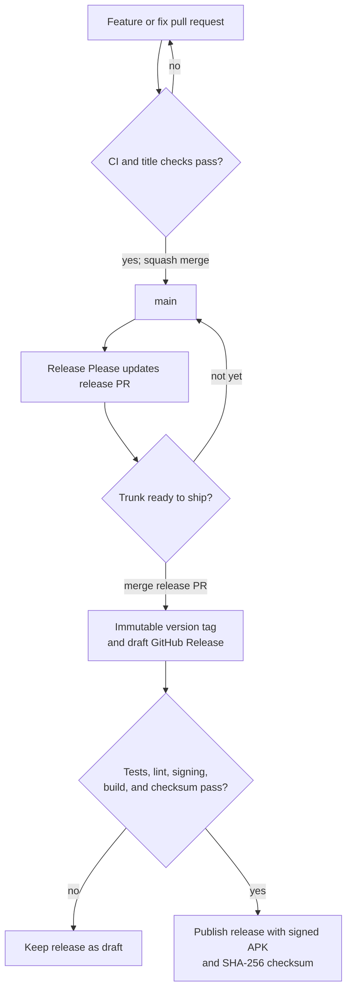

# Releasing Diarium

Diarium uses trunk-based development with one long-lived branch, `main`.
Releases are selected by merging a generated release pull request rather than
by creating a release branch.

## Release flow



1. Merge normal pull requests into `main` using squash merge.
2. Release Please reads the squash-merge titles and maintains one release pull
   request containing the next version and generated changelog.
3. Review and merge that pull request when the current trunk is ready to ship.
4. Release Please creates an immutable `vMAJOR.MINOR.PATCH` tag and a draft
   GitHub Release.
5. The release workflow checks out that exact commit, reruns the non-device
   quality gate, builds and verifies a signed APK, attaches the APK and SHA-256
   checksum, and publishes the draft.
6. If signing, tests, lint, or compilation fail, the GitHub Release remains a
   draft.

`version.txt` is the source of truth for the user-visible Android version.
Gradle derives the monotonically increasing Android `versionCode` as:

```text
major * 1,000,000 + minor * 1,000 + patch
```

Each SemVer component is therefore limited to `0..999`.

## Conventional pull request titles

The CI workflow validates pull request titles because GitHub uses the title as
the squash-merge commit message:

| Title | Release effect |
| --- | --- |
| `fix: reject malformed inspection calls` | Patch |
| `feat: export the journal` | Minor |
| `feat!: replace the persisted journal format` | Major |
| `docs: explain export` | No release by itself |
| `test: expand planner properties` | No release by itself |
| `chore: update tooling` | No release by itself |

Scopes are optional, for example `fix(parser): reject contradictory values`.
Direct commits to `main` must follow the same convention.

If the calculated version is inappropriate, use a Conventional Commit body
footer such as:

```text
Release-As: 1.0.0
```

Do not manually move or recreate published version tags.

## One-time GitHub configuration

### Android signing

Create and permanently back up a release keystore outside the repository:

```powershell
keytool -genkeypair -v `
  -keystore diarium-release.jks `
  -alias diarium `
  -keyalg RSA `
  -keysize 4096 `
  -validity 10000
```

Losing this keystore prevents future APKs from updating an installation signed
with it. Never commit the keystore or its passwords.

Encode the keystore for GitHub Actions:

```powershell
[Convert]::ToBase64String(
    [IO.File]::ReadAllBytes("diarium-release.jks")
) | Set-Clipboard
```

Add these repository Actions secrets:

| Secret | Value |
| --- | --- |
| `ANDROID_SIGNING_KEY_BASE64` | Base64 keystore contents |
| `ANDROID_KEYSTORE_PASSWORD` | Keystore password |
| `ANDROID_KEY_ALIAS` | `diarium`, unless another alias was chosen |
| `ANDROID_KEY_PASSWORD` | Private-key password |

### Release Please token

Add a fine-grained personal access token as `RELEASE_PLEASE_TOKEN` with access
to this repository and read/write permissions for contents, pull requests, and
issues. A pull request created with that token triggers the normal CI workflow.

The dedicated token is required. This avoids two limitations of the default
`GITHUB_TOKEN`: repositories may prohibit it from creating pull requests, and
events created with it do not trigger another workflow run.

If a run has already failed with:

```text
GitHub Actions is not permitted to create or approve pull requests
```

add `RELEASE_PLEASE_TOKEN` and rerun the failed workflow. Release Please will
reuse the branch it already created and open or update the release pull request;
the branch does not need to be deleted manually.

If you intentionally want to use `GITHUB_TOKEN` instead, change the workflow
token and enable:

`Settings → Actions → General → Workflow permissions → Allow GitHub Actions to
create and approve pull requests`.

Keep the repository configured for squash merging so the validated pull request
title becomes the single Conventional Commit on `main`.

## Manual controls

Run the `GitHub Release` workflow manually to refresh Release Please without a
new push. This does not publish a release unless a release pull request has
already been merged.

To intentionally request a specific next version, merge a commit containing a
`Release-As: MAJOR.MINOR.PATCH` footer. Release Please still generates the
reviewable release pull request before tagging anything.
