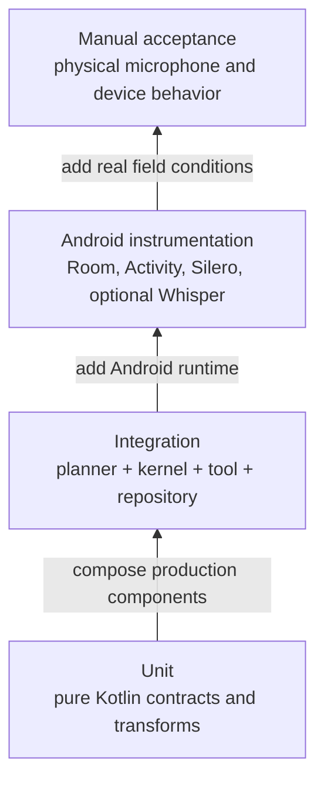

# Testing strategy

Diarium uses a layered test strategy so most failures are found without an
emulator, while Android-specific persistence and native speech dependencies
are still exercised on a real Android runtime.



Each higher layer adds runtime fidelity and cost. Safety rules remain concentrated
in the fast lower layers, while native integration and speech quality are
verified where their real dependencies exist.

| Layer | Scope | Current coverage |
| --- | --- | --- |
| Unit | Pure Kotlin contracts and transformations | JSON Schema, deterministic multilingual planning, guardrails, model-adapter parsing, Unicode transcript parsing, PCM16 WAV encoding |
| Integration | Multiple production components with controlled adapters | Serbian Cyrillic transcript → deterministic kernel plan → explicit execution → inspection repository |
| Android instrumentation | Android framework and native dependencies | Room write/read ordering, Activity launch, bundled Silero ONNX inference, optional provisioned Whisper initialization through Llamatik |
| Manual acceptance | Physical microphone, transcription quality, latency, thermal behavior | English, German, Serbian Latin, and Serbian Cyrillic voice commands on a representative phone |

The integration test deliberately checks that planning leaves the repository
unchanged. Persistence occurs only when the planned call is executed, matching
the confirmation boundary in the app.

## Executable specifications and contracts

The testing vocabulary is intentionally split by purpose:

- `docs/features/*.feature` contains short Gherkin product specifications. They
  describe user-visible behavior and are the acceptance-language source for
  product discussion.
- `RecordInspectionFeatureTest` is the executable common-Kotlin counterpart for
  the current Gherkin scenarios. It crosses planner, kernel, tool, and an
  in-memory repository without requiring Android.
- kernel invariant tests enforce microkernel safety properties such as
  planning being side-effect free, blank input not invoking a planner, unknown
  tools not executing, and duplicate tool names being rejected.
- reusable planner and mutating-tool conformance helpers define contracts that
  future implementations can run without copying every assertion.
- Kotest property checks generate hundreds of identifier, language, casing,
  punctuation, whitespace, ambiguity, and unrelated-text combinations. Kotest
  is used only as a KMP property generator; the existing `kotlin-test` runner
  remains in place.

The `.feature` files are not executed through Cucumber-JVM. Their common-Kotlin
counterparts are the executable gate, which keeps the specification portable
across Android and iOS without introducing a JVM-only runner. A behavior change
must update both the readable scenario and its executable counterpart in the
same review.

Gherkin examples stay deliberately small and representative. A field failure
becomes one named regression example, while property tests cover families of
equivalent inputs and conformance suites cover every implementation of a
contract. This avoids turning every possible transcript into a hand-written
acceptance scenario.

If a property check fails, preserve the reported seed while debugging and add
the smallest meaningful counterexample to the fixed evaluation corpus when it
represents a real domain rule. Randomly generated cases do not replace the
owned multilingual corpus or physical microphone acceptance.

## CI gates

The main CI workflow has three jobs:

1. Linux runs Detekt, Konsist/core tests, all shared-logic and shared-UI tests,
   Android lint, and debug app/test APK builds.
2. An API 35 x86_64 emulator runs the Room, launch, and native speech
   instrumentation suite under Android Test Orchestrator.
3. macOS builds the iOS simulator app and its embedded KMP framework.

CodeQL independently scans Actions, Java/Kotlin, and Swift. Its manual build
now compiles the real core, shared, Android, and iOS targets. JavaScript was
removed from the matrix because this repository has no JavaScript product
source.

Test reports, lint reports, and Android APKs are retained as workflow
artifacts. Workflow concurrency cancels stale runs for the same branch.

## Local verification

Run the non-device gate with:

```powershell
.\gradlew.bat detekt :core:jvmTest :app:sharedLogic:allTests `
  :app:sharedUI:allTests :app:androidApp:assembleDebug `
  :app:androidApp:assembleDebugAndroidTest :app:androidApp:lintDebug
```

Run Android instrumentation with:

```powershell
.\gradlew.bat :app:androidApp:connectedDebugAndroidTest
```

`connectedDebugAndroidTest` installs and later removes the target package.
Use an emulator or a test device when its app data matters.

The Whisper initialization test skips when no `.bin` file exists in the
target app's private `files/whisper-models` directory. CI still exercises
Silero and all other instrumentation tests without downloading a large speech
model. A provisioned release/device gate must run the Whisper test without a
skip.

## Multilingual release acceptance

Use a multilingual Whisper model; `.en` variants are not acceptable. Record
and confirm all of these on a physical device:

- English: `I inspected hive 4 and saw the queen.`
- German: `Ich habe Bienenstock 4 kontrolliert und die Königin gesehen.`
- Serbian Latin: `Pregledao sam košnicu 4 i video maticu.`
- Serbian Cyrillic: `Прегледао сам кошницу 4 и видео матицу.`

For each phrase, verify the transcript, planned `hive_id`, and
`queen_seen` value before confirming. Then force-stop and relaunch the app and
verify that Room restores the journal entry. Test cancellation once per
language and confirm that it writes nothing.

Native ASR quality is data- and device-dependent, especially for lower-resource
languages. German and Serbian golden-audio fixtures should be added once the
team owns representative, consented recordings that can legally live in the
test repository.

## Quality and performance measurement

Use the same versioned corpus for every parser or model comparison. Record at
least these correctness metrics:

- exact match for `hive_id` and `queen_seen` separately;
- fully correct end-to-end command rate;
- abstention rate for missing, contradictory, hedged, or unsupported input;
- false-accept rate, where confirmation is enabled for an incorrect value.

False accepts are the safety-critical metric and have a release target of zero
on the owned corpus. Abstention is not automatically a defect: for uncertain
speech it is safer than an invented journal entry. The four 2026-07-14 field
transcripts are permanent deterministic-planner regressions.

Once consented golden audio exists, measure Whisper independently with word or
character error rate and then measure end-to-end field accuracy. This separates
speech-recognition failures from deterministic-planner coverage failures.

On a representative physical phone, collect p50 and p95 for transcription,
planning, and confirmed persistence. Record peak process RSS, Java and native
heap, battery change, and thermal throttling over a fixed repeated run. Android
Studio Profiler and Perfetto are sufficient for initial CPU, memory, and system
traces; a continuous profiling backend is not required for this local-only
stage.

The next observability increment should be a small, privacy-preserving local
diagnostic event stream with stage duration, outcome category, app version,
device/model profile, and no raw transcript or audio by default. A user-driven
JSON export is more useful than OpenTelemetry until a synchronization service
and collector actually exist.
